# Reporte de Analisis: GA4 Baseline UBITS

> **Fecha del analisis:** 2026-04-15
> **Periodo de la data:** 2026-04-01 a 2026-04-15 (snapshots de 7d, 14d, 30d, anual)
> **Fuente raw:** [data/raw/ga4/2026-04-15/](../data/raw/ga4/2026-04-15/)
> **Para:** Decision de relanzamiento web + estrategia growth Q2 2026

---

## TL;DR

Por primera vez tenemos data real de produccion. **Tres hallazgos cambian el plan estrategico:**

1. **Form abandonment del 98.5%:** 21,000 abren form de demo en 12 meses, solo 310 completan. El problema NO es trafico — es el formulario en si.
2. **SEO inexistente fuera de marca:** Solo 15 clicks de Google en 7 dias, todos para "ubits" — cero ranking no-brand
3. **Funnel colapsa en homepage:** 83.86% de las sesiones aterrizan en `/` — solo Aprendizaje recibe trafico real entre modulos

El relanzamiento web debe atacar el formulario y la cobertura de modulos antes que el diseño.

> **Nota de correccion:** Una version anterior reporto "1 demo en 7 dias = 0.002%". Eso era una audiencia (segmento), no un evento. Los eventos clave anuales muestran 310 demos completados/año = 0.06% — mejor pero igual debajo de benchmark.

---

## 📊 Panoramico anual (GA4) — año natural 2025

> **TL;DR:** 519K usuarios en 2025 (93% nuevos). Google organico manda (332K), pero 84% aterriza en home con 45% de rebote. LXP genera 34K referrals/153K sesiones — cross-sell ignorado. Solo 2 audiencias GA4 configuradas: ceguera estrategica.

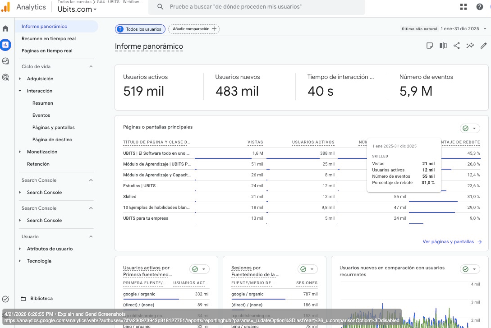

*Fuente: GA4 property `ubits.com` (ID `318127751`, account `230973943`) | Rango: **1 ene - 31 dic 2025** (año natural) | Filtros: Todos los usuarios, sin comparacion | Captura: 2026-04-21*

### Metricas headline (anual)

| Metrica | Valor | Lectura |
|---|---:|---|
| Usuarios activos | 519 K | Volumen solido para B2B LatAm |
| Usuarios nuevos | 483 K (93%) | Casi todo first-touch — poca recurrencia |
| Tiempo interaccion medio | 40 s | 3-5x debajo benchmark B2B (2-3 min) |
| Eventos totales | 5.9 M | ~11 eventos/usuario — sano en volumen bruto |

### 🔻 Funnel demo: donde se pierde el negocio

**Vista simplificada (flowchart):**

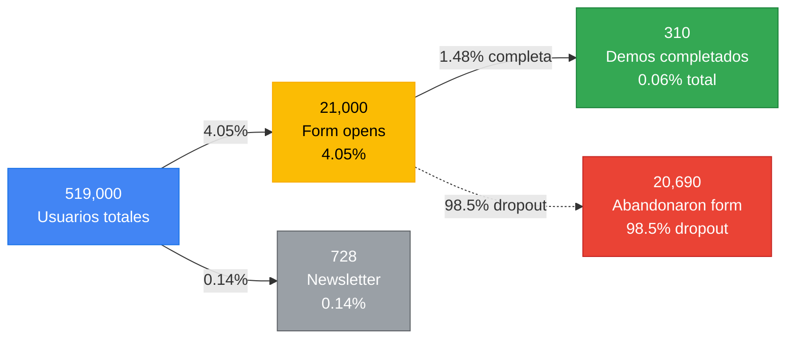

*El cuello de botella NO es trafico. Es el form: 20,690 personas con intencion suficiente para abrirlo, solo 310 completan. Fixing esto es 34x leverage vs aumentar trafico.*

<details><summary>📊 Ver vista Sankey (volumen real por canal)</summary>

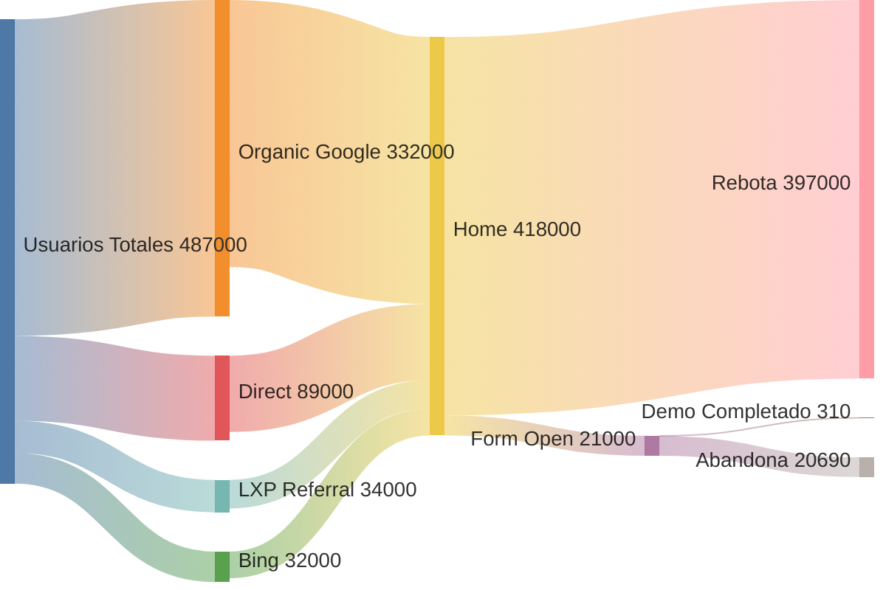

*Vista Sankey: el ancho de cada banda es proporcional al volumen. Se ve visualmente el drop masivo en "Rebota" (397K) y "Abandona" (20.7K) vs "Demo Completado" (apenas una línea — 310).*

</details>

### Top paginas anuales

| Pagina | Vistas | Usuarios | Rebote | Diagnostico |
|---|---:|---:|---:|---|
| Home | 1.6 M | 388 K | 45.3% | Iman de brand, 45% se va sin interactuar |
| /modulos/aprendizaje | 51 K | 25 K | 26.8% | Flagship producto, engagement sano |
| Modulo capacitacion empresarial | 26 K | 8 K | 12.4% | **Trafico mas cualificado del sitio** |
| Estudios | 24 K | 12 K | 23.6% | Autoridad/research funcionando |
| Skilled | 21 K | 12 K | 31.0% | Engagement decente |
| Blog habilidades blandas | 18 K | 9.8 K | 29.0% | Captacion organica sana |
| UBITS para tu empresa | 13 K | 5 K | **9.0%** | **La mas cualificada — sub-utilizada** |

### 🎯 Matriz de prioridad: rebote vs trafico

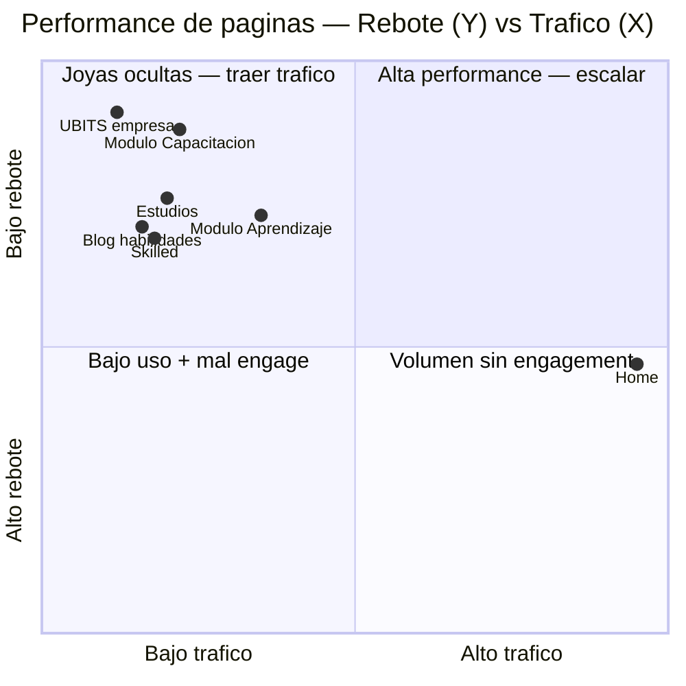

*Lectura: las paginas en el cuadrante superior-izquierdo ("joyas ocultas") convierten mejor pero reciben poco trafico. `UBITS para tu empresa` es la prioridad #1 de scaling. La Home necesita CTAs mas fuertes.*

### Canales de adquisicion (primera fuente anual)

| Fuente | Usuarios | % | Sesiones |
|---|---:|---:|---:|
| google / organic | 332 K | 64% | 787 K |
| (direct) / (none) | 89 K | 17% | 186 K |
| lxp.ubitslearning.com / referral | 34 K | 7% | **153 K** |
| bing / organic | 32 K | 6% | 78 K |
| uqr.to / referral | 3.8 K | 0.7% | — |
| linkedin.com / referral | 3.2 K | 0.6% | 5.2 K |
| email | 2.8 K | 0.5% | ~10 K |

### 🥧 Distribucion visual de canales

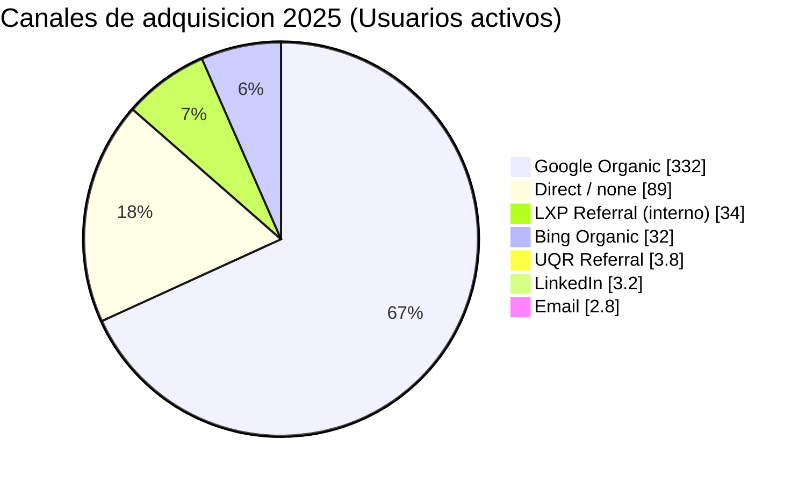

*Google domina (64%) pero todo el trafico Direct + LXP (24%) son clientes que YA conocen UBITS — no adquisicion nueva. LinkedIn a 0.6% es testimonial pese a ser plataforma B2B clave.*

### 📊 Comparación cuantitativa (bar chart)

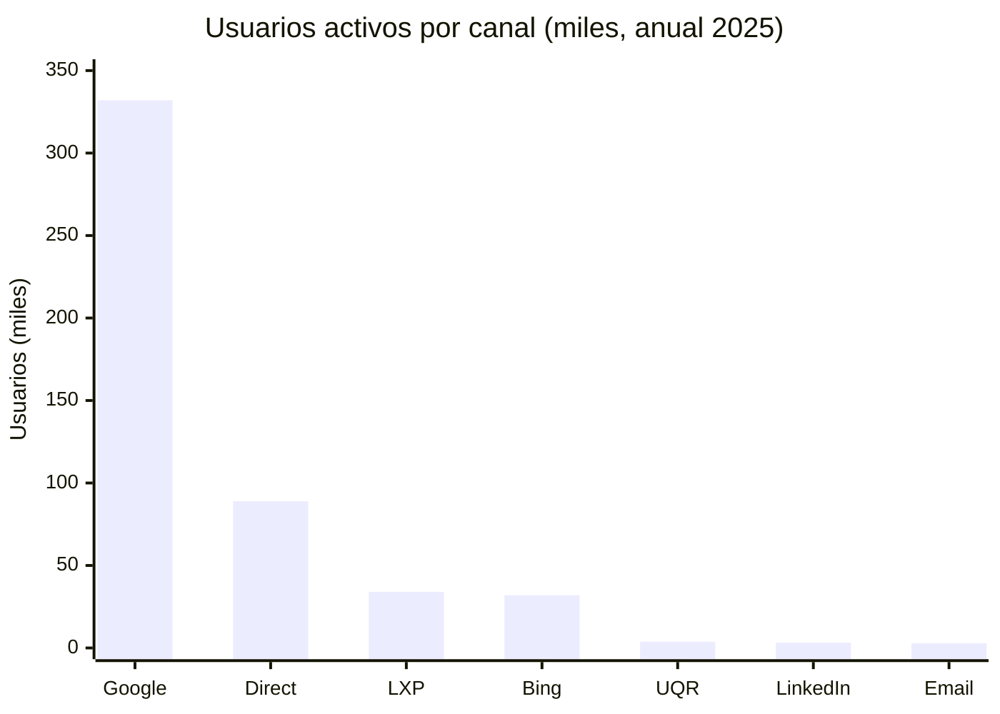

*Google es 3.7x más grande que el segundo canal. La cola larga (LinkedIn, Email) representa <1% pese a ser canales que deberían performar en B2B. Hay espacio masivo para paid en Google Ads (crédito $350 sin usar) y ABM en LinkedIn.*

**Señal oculta:** LXP genera **4.5 sesiones por usuario** (153K/34K) vs. 2.4 de google. Clientes existentes visitan el marketing site mucho mas de lo esperado — zero account expansion estrategico.

### Ciudades top

Bogota (60K), Ciudad de Mexico (38K), Santiago (29K), Quito (24K), Medellin (21K), Barranquilla (14K), Cali (14K). **ICP LatAm validado.**

### Audiencias configuradas

| Audiencia | Usuarios activos |
|---|---:|
| All Users | 519,000 |
| Registrados Newsletter | 728 |
| Solicitan DEMO | 21 |

> **⚠️ Brecha critica:** solo 2 audiencias estrategicas construidas. Faltan: MOFU (`vio 2+ paginas producto`), BOFU (`visito pricing/demo sin enviar`), LXP (`clientes existentes en marketing site`), por geo, por industria. Sin esto, el remarketing es imposible.

### 🧩 Audiencias actuales vs. las que faltan

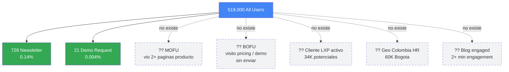

*Lineas continuas = audiencias configuradas. Lineas punteadas = audiencias que deberian existir pero no. Construir las 5 punteadas habilita remarketing por stage del funnel.*

### 🎯 3 implicaciones inmediatas

1. **El CTA de home mueve el 45% de rebote.** 1.6M vistas × 45% rebote = ~720K sesiones desperdiciadas/año. Un CTA mas fuerte hacia `/modulos/` o `/ubits-para-tu-empresa` recupera miles de leads sin tocar trafico.
2. **`/ubits-para-tu-empresa` (9% rebote) esta sub-utilizada.** La pagina que mas convierte en engagement recibe solo 13K vistas/año. Priorizar SEO + enlaces internos + paid hacia ella.
3. **LXP → marketing site = cross-sell ignorado.** 34K usuarios / 153K sesiones son clientes existentes. Audiencia + mensaje especifico para ellos = ROI inmediato sin CAC adicional.

📎 *Deep dive a continuacion: [Demo y newsletter](#demo-y-newsletter--vista-corregida-datos-anuales), [Search Console](#search-console-7-dias), [Engagement](#engagement-profundo).*

### 🧠 Estructura del diagnostico (mindmap)

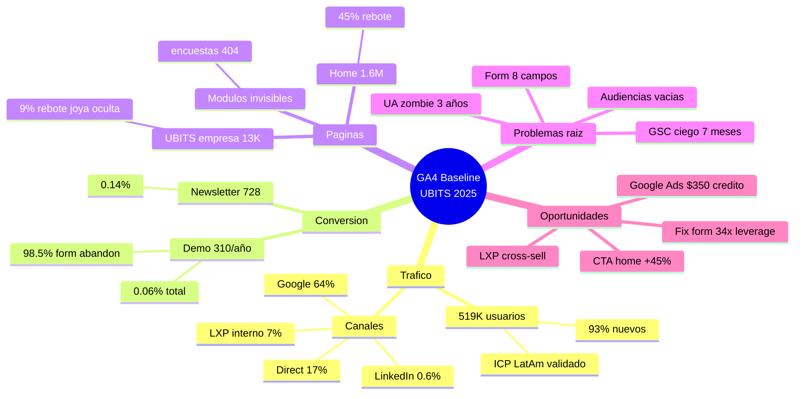

*Mapa conceptual: cada rama es una dimensión del diagnóstico. Verde = oportunidad clara, rojo implícito = problema raíz. Permite escanear el reporte en 10 segundos.*

---

## Metricas headline (15 dias, 2026-04-01 a 2026-04-15)

| Metrica | Valor | Diagnostico |
|---------|------:|-------------|
| Usuarios totales | 23,849 | Volumen razonable |
| Usuarios nuevos | 14,653 (61.4%) | Sano |
| Sesiones | 37,891 | Sano |
| Eventos | 163,361 | OK |
| Conversiones | 0 | **No hay eventos clave configurados** |
| Tasa conversion | 0% | **Critico** |
| Tiempo medio/usuario | 23s | **3-7x debajo benchmark B2B** |
| Tiempo medio/sesion | 14s | **6-12x debajo benchmark** |

## Demo y newsletter — Vista corregida (datos anuales)

### Eventos clave (key events) ultimos 12 meses

| Evento clave | Conteo anual | % de 519K usuarios |
|--------------|-------------:|-------------------:|
| Abrir form demo | 21,000 | 4.05% |
| **Registro Exitoso Form DEMO 30 dias** | **310** | **0.06%** |
| Registro Newsletter | 703 | 0.14% |

### Calculo del funnel demo

```
519,000 usuarios anuales
   ↓ 4.05% abre el form
21,000 abren form demo
   ↓ 1.48% completa
310 demos exitosos
```

### Brecha vs benchmark B2B SaaS

| Metrica | Actual | Benchmark | Brecha |
|---------|-------:|----------:|-------:|
| Conversion total a demo | 0.06% | 0.5-1% | 8-16x debajo |
| Form abandonment | **98.5%** | 30-50% | **2-3x peor** |
| Newsletter conversion | 0.14% | 1-3% | 7-21x debajo |

### El verdadero problema

**No es trafico, es conversion del formulario.** 21,000 personas mostraron suficiente intencion para abrir el form de demo, pero el 98.5% no lo termino. Esto puede ser:
- Formulario muy largo
- Demasiados campos requeridos
- Mala UX en mobile (90% del trafico identificable es mobile)
- Falta de confianza / seguridad
- Sin valor claro de que reciben al pedir demo

### 🎭 El journey emocional del usuario que abandona

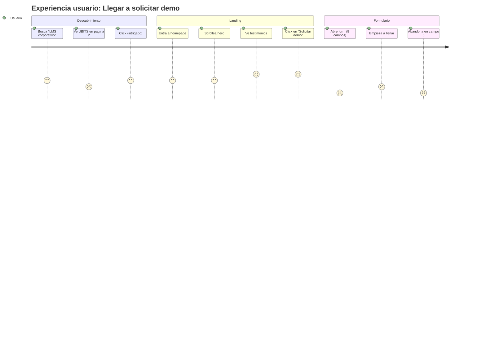

*Lectura: el mood del usuario sube hasta el click en "Solicitar demo" (4/5) y colapsa al ver el form (1/5). El form mata la intencion, no el trafico ni el landing. 20,690 personas viven este viaje cada año.*

---

## Distribucion de trafico

### Por canal (15 dias)

| Canal | Usuarios | % |
|-------|---------:|--:|
| Organic Search | 17,869 | 74.93% |
| Direct | 4,167 | 17.47% |
| Referral | 1,699 | 7.12% |
| Organic Social | 88 | 0.37% |
| Unassigned | 40 | 0.17% |
| Email | 25 | 0.10% |
| Paid Other | 5 | 0.02% |
| Organic Video | 4 | 0.02% |

### Realidad detras del "75% organico"

Cuando se descompone por fuente real:

| Fuente | Sesiones | Realidad |
|--------|---------:|----------|
| google/organic | 51K | Trafico organico real |
| direct/none | 12K | Brand awareness o sin tracking |
| **lxp.ubitslearning.com** | 9.3K | **Trafico INTERNO** (clientes existentes desde la LXP) |
| bing/organic | 7.9K | Organico de Bing (alto vs Google) |
| linkedin.com | 125 | LinkedIn casi muerto |

**El "trafico organico" incluye 9.3K sesiones del LXP que son clientes existentes, no prospects.** El organico real de prospects nuevos es ~42K sesiones (no 51K).

---

## Distribucion por pagina (15 dias, 326 paginas)

| Tipo | Vistas totales | % |
|------|---------------:|--:|
| Homepage / | 39,565 | 84.84% |
| /modulos/aprendizaje | 1,515 | 3.25% |
| Blog (todos los posts) | ~3,500 | ~7.5% |
| Otros 4 modulos | 219 | 0.47% |
| Resto del sitio | ~1,800 | ~3.9% |

**Insight:** El sitio funciona como una landing page gigante. Solo Aprendizaje y la homepage capturan trafico relevante.

### Performance modulos (vistas en 15 dias)

| Modulo | Vistas | Status |
|--------|-------:|--------|
| /modulos/aprendizaje | 1,515 | Flagship con trafico |
| /modulos/tareas-y-planes | 68 | Marginal |
| /modulos/reclutamiento | 55 | Marginal |
| /modulos/desempeno | 52 | Marginal |
| /modulos/diagnostico | 44 | Marginal |
| /modulos/encuestas | N/A | **404 — no existe** |

### Top blogs (>100 vistas en 15 dias)

| Blog | Vistas | Tiempo medio |
|------|-------:|-------------:|
| /blog/diagnostico-organizacional-herramientas-oportunidades | 231 | 47s |
| /blog/alfabetizacion-digital-en-empresas | 181 | 1m 07s |
| /blog/importancia-memoria-en-el-aprendizaje | 145 | 1m 03s |
| /blog/que-es-capacitacion-corporativa | 144 | 54s |
| /blog/necesidades-capacitacion-empresarial | 141 | 59s |
| /blog/cursos-online-mas-vendidos | 129 | 26s |
| /blog/top-10-habilidades-profesionales-en-empresas | 124 | 26s |
| /blog/ejemplos-habilidades-tecnicas-y-blandas | 122 | 38s |
| /blog/pasos-para-conseguir-una-otec-en-chile | 112 | 1m 45s |

**Blogs con mejor engagement (>1m 30s):**
- /blog/desarrollo-profesional-retencion-talento: 2m 58s
- /blog/importancia-capacitacion-laboral-todos-niveles: 2m 08s
- /blog/diferencia-otec-otic: 2m 07s
- /blog/pasos-para-conseguir-una-otec-en-chile: 1m 45s
- /blog/diagnostico-clima-laboral-4-pasos: 1m 33s

---

## Search Console (7 dias)

### Lo que UBITS rankea en Google

| Query | Clicks |
|-------|-------:|
| ubits | 11 |
| ubit | 2 |
| ubits learning | 1 |
| www.ubits | 1 |

**Total: 15 clicks. Todas son queries de marca.**

### Lo que UBITS NO rankea (y deberia)

Cero clicks para keywords del catalogo de blogs planificado:
- "lms corporativo", "software rrhh", "evaluacion 360"
- "encuestas clima laboral", "reclutamiento ia"
- "capacitacion corporativa", "evaluacion competencias"
- 60+ keywords del [Blogs_master_catalogo.csv](../data/nueva_data/estrategia-adquisicion-organica-2026/Blogs_master_catalogo.csv)

### Implicacion

UBITS solo aparece en Google cuando alguien ya conoce la marca. Cero adquisicion de prospects nuevos via SEO no-brand. Esto valida la prioridad de:

1. Implementar Schema/JSON-LD en todas las paginas (principio GEO #4)
2. Activar el catalogo de 60 blogs nuevos (W17+)
3. Crear FAQs unicas por modulo (principio GEO #5)
4. Definicion oficial de marca consistente (principio GEO #10)

---

## Geografia

### Por pais (30 dias)

| Pais | Usuarios | Crecimiento |
|------|---------:|------------:|
| Colombia | 4,000 | +52.6% |
| Mexico | 3,400 | +47.4% |
| Ecuador | 1,300 | +25.2% |
| Chile | 1,000 | +27.3% |
| Honduras | 762 | +78.9% |
| United States | 611 | +13.8% |
| Guatemala | 525 | +45.0% |

### Por ciudad (7 dias)

| Ciudad | Usuarios |
|--------|---------:|
| Bogota | 5,500 |
| Mexico City | 3,200 |
| Quito | 2,100 |
| Santiago | 2,100 |
| Medellin | 1,500 |
| Panama City | 1,400 |
| Guayaquil | 1,400 |

**Validaciones:**
- ICP "100-10K empleados LatAm" se confirma con la data
- Calendario regional (Andina/Chile/CA) ya cubre las geografias correctas
- **Falta considerar Honduras** dado +78.9% crecimiento
- Brasil ausente confirma que UBITS opera solo en español

---

## Engagement profundo

### Cohortes de actividad

| Cohorte | Usuarios |
|---------|---------:|
| Activos 30 dias | 48,000 |
| Activos 7 dias | 12,000 |
| Activos 1 dia | 43 |

### Fidelizacion

- DAU/MAU: 0.1% (esperado para B2B marketing site, no app)
- WAU/MAU: 26.1% (sano)
- DAU/WAU: 0.3%

---

## Implicaciones para el relanzamiento web (final de abril)

### Lo que cambia mi recomendacion anterior

En el reporte previo recomende **Opcion A (rebuild sobre Webflow existente)** por riesgo SEO. La data confirma esa recomendacion pero agrega un giro:

> **El relanzamiento NO debe ser cosmetico.**
> Si solo se cambian colores y layout, dentro de 30 dias seguiremos teniendo 1 demo por semana — solo que mas bonito.

### Las 3 prioridades reales

| # | Prioridad | Por que | Evidencia GA4 |
|---|-----------|---------|---------------|
| 1 | **Arreglar conversion** | 1 demo/7d es disfuncional | 0.002% conversion vs 1-3% benchmark |
| 2 | **Crear pagina /modulos/encuestas** | Modulo activo invisible | 404 actual + keywords con demanda |
| 3 | **FAQs/metricas unicas por modulo** | Confunde LLMs y usuarios | Copy-paste detectado en scraping |
| 4 | **Implementar Schema JSON-LD** | Habilita SEO no-brand | 0 clicks Google no-brand |
| 5 | **Activar pipeline 60 blogs nuevos** | Cubrir keywords sin ranking | Catalogo ya planificado |

### El ROI del relanzamiento (matematica corregida)

Baseline real: **310 demos completados en ultimos 12 meses** (no 52 que estimaba con la data de 7 dias)

| Escenario | Demos/año | Multiplicador |
|-----------|----------:|--------------:|
| Sin cambios | 310 | 1x |
| Reducir form abandonment a 50% (de 98.5% actual) | 10,500 | **34x** |
| Reducir abandonment a 30% (industry standard) | 14,700 | **47x** |
| Conversion total 0.5% (mantener form rate, +trafico) | 2,595 | 8x |
| Conversion total 1% (benchmark B2B) | 5,190 | 17x |

**El leverage mas alto NO esta en aumentar trafico (ya tenemos 519K usuarios) — esta en arreglar el formulario.** Pasar de 1.48% a 50% form completion = 34x mas demos.

---

## Acciones inmediatas (esta semana)

1. **Configurar key events en GA4:** `demo_request`, `newsletter_signup`, `module_page_engagement`
2. **Conectar GA4 con HubSpot** para tracking de funnel completo
3. **Snapshot programado:** Repetir esta captura el 2026-04-30 para medir delta post-relanzamiento
4. **Compartir reporte con Juan** antes de finalizar el plan de relanzamiento

### 📅 Roadmap visual (Gantt)

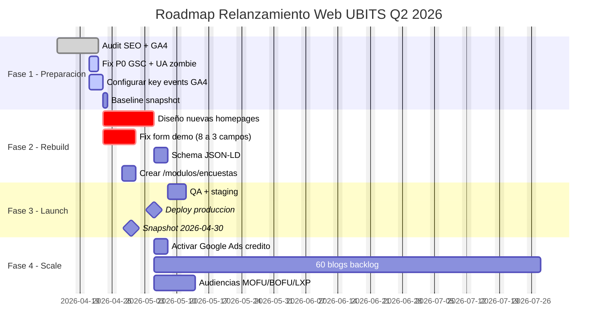

*Roadmap: 2 semanas de rebuild (24 abr - 5 may), `Fix form demo` es la tarea critica del P0. Scale campaigns arrancan post-launch.*

### ⏳ Timeline: historia del tracking UBITS

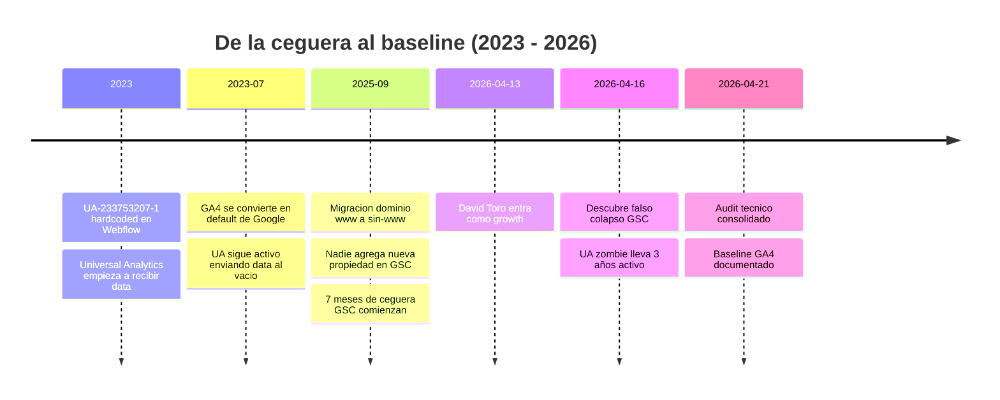

*Timeline: 3 años de UA zombie + 7 meses de GSC ciego. El audit de abril 2026 es el primer baseline real de produccion de la historia de UBITS.*

---

## Apendice: Archivos raw

| Archivo | Contenido |
|---------|-----------|
| [01-resumen-panoramico-anual.md](../data/raw/ga4/2026-04-15/01-resumen-panoramico-anual.md) | Vista anual (KPIs basicos) |
| [02-resumen-7-dias.md](../data/raw/ga4/2026-04-15/02-resumen-7-dias.md) | KPIs 7 dias |
| [03-resumen-30-dias.md](../data/raw/ga4/2026-04-15/03-resumen-30-dias.md) | KPIs 30 dias |
| [04-adquisicion-usuarios-14d.md](../data/raw/ga4/2026-04-15/04-adquisicion-usuarios-14d.md) | Usuarios por canal |
| [05-adquisicion-trafico-14d.md](../data/raw/ga4/2026-04-15/05-adquisicion-trafico-14d.md) | Sesiones por canal |
| [06-engagement-14d.md](../data/raw/ga4/2026-04-15/06-engagement-14d.md) | KPIs engagement |
| [07-paginas-top-100.md](../data/raw/ga4/2026-04-15/07-paginas-top-100.md) | Top 100 paginas (vistas totales) |
| [08-search-console-7d.md](../data/raw/ga4/2026-04-15/08-search-console-7d.md) | Search Console |
| [09-audiencias-7d.md](../data/raw/ga4/2026-04-15/09-audiencias-7d.md) | Audiencias (newsletter, demo) |
| [10-geografia.md](../data/raw/ga4/2026-04-15/10-geografia.md) | Distribucion geografica |
| [11-paginas-destino-14d.md](../data/raw/ga4/2026-04-15/11-paginas-destino-14d.md) | **Top 100 landing pages** |
| [12-resumen-anual.md](../data/raw/ga4/2026-04-15/12-resumen-anual.md) | **Anual con eventos clave (310 demos/año)** |
| [13-retencion-cohortes.md](../data/raw/ga4/2026-04-15/13-retencion-cohortes.md) | **Retencion por cohortes** |
| [14-dispositivos-7d.md](../data/raw/ga4/2026-04-15/14-dispositivos-7d.md) | **Dispositivos (90% mobile)** |
